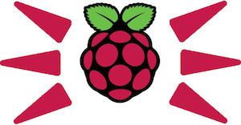

# Raspberry Pi Alarm



## Overview

Control an alarm with a Raspberry Pi over the internet! Development teams at [T-Mobile](https://opensource.t-mobile.com/) use Pi-Alarm to provide a clear visual alert to developers whenever something goes wrong. Here are a few examples of triggers that turn on the alarm at T-Mobile:

* Build failures
* Automated test failures
* Custom telemetry triggers
* When the boss walks over and we want them to go away
* When an application or web service becomes unresponsive in production
* Lunch time!

## User Documentation

This readme file is geared towards developers looking to contribute to this project. For instructions on building and using pi-alarm, check out the [end-user documentation](docs/).

## Developer Guide

**You don't need a Raspberry Pi to contribute!** However, it helps if you're already familiar with the [end-user documentation](docs/) which covers the [overall design](docs/), [software installation instructions](docs/software-instructions.md), and [hardware build instructions](docs/build-instructions.md).

Once you're familiar with and understand the hardware build, software installation, and usage instructoins, then you're ready to start contributing!

### Clone the Repository

```bash
git clone https://github.com/tmobile/pi-alarm.git
```

### Install Development Dependencies

You'll need the folowing software to build and run the Pi-Alarm project:

### Getting Python 3

Check to see if you have Python 3 installed already. To check, in your terminal run the following command:

```bash
$ python -V
Python 3.7.0
```

If you get an error, [download and install](https://www.python.org/downloads/) the latest version of Python 3.

> *Note for Cygwin users: If you installed Python/Pip3 via Cygwin, you will need to install Python on Windows OS explicitly and add it to your `PATH` for the unit tests to run succesfully.

#### Getting Python 3 on the Pi

Your Raspberry Pi might be Python 2 by default. To use Python 3 on the Pi, change /usr/bin/python to point to /usr/bin/python3:

```bash
sudo su
rm /usr/bin/python
ln -s /usr/bin/python3 /usr/bin/python
```

### Install Required Packages

```bash
pip install Flask Flask-API flask-cors PyYAML
```

## Testing

To make sure everything is working and read-to-go, run the unit tests:

```bash
python -m unittest
```

Make sure all tests pass. If not, you'll have to troubleshoot.

## Debugging

You can interactively debug the app while it is running.  

```bash
sudo su
export FLASK_APP=alarm.py
export FLASK_DEBUG=1
flask run
```

## Contributions

Code contributions are most likely to be accepted if they are useful, well documented, and covered by unit tests.

We'd love to hear how you are using Pi-alarm.  Post pictures of how you are using your setup [here](docs/user_contrib/README.md).

## Forking

We welcome people experimenting with different platforms and different software versions.  Please note that we cannot provide support or modifications for platforms and software different than what we use.  However, you should feel free to fork the tree for new platforms and software.  As per best practices, have your Information Technology department review this source code or any forks prior to any production or consequential use.  Please note that any forms of the tree are to comply with any open source licenses including Apache 2.0.