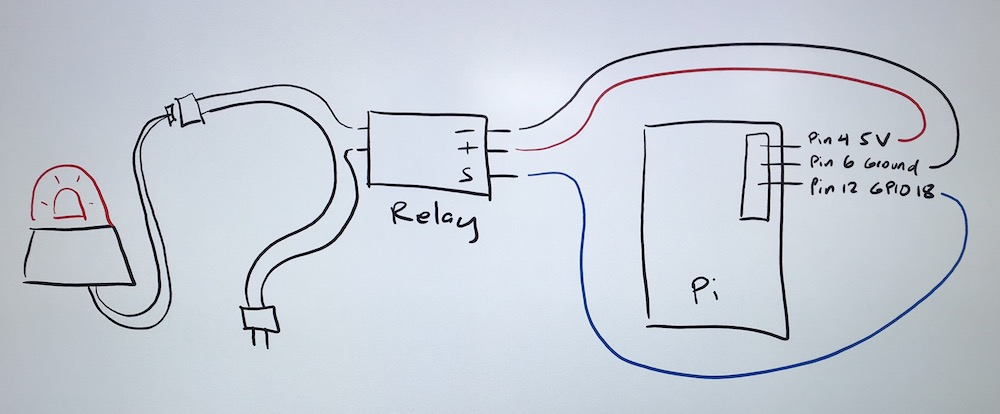
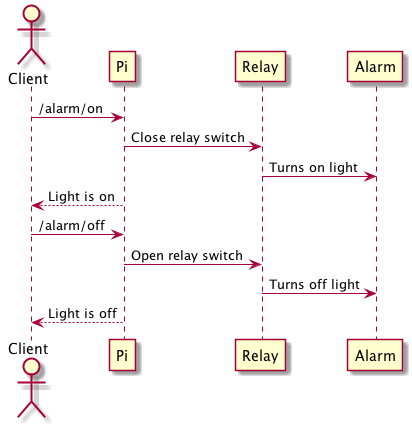

# Raspberry Pi Alarm


## Overview

Control an alarm with a Raspberry Pi


## Equipment/Parts

- Raspberry Pi 3
- Monitor with HDMI
- Wireless keyboard, mouse
- Ethernet cable
- 5VDC Relay switch
- Alarm
- Extension cord
- Jumper wires
- Housing for relay
- USB Battery pack (optional)


## Raspberry Pi Setup

Install [NOOBS](https://www.raspberrypi.org/help/noobs-setup/2)

Connect the monitor, wireless keyboard, mouse, and power to Pi.

Boot and bring up the desktop.

## Design

The Raspberry Pi will run a Python program that acts as a REST server.  The program will control a GPIO pin.  The GPIO pin will control the relay switch.  The relay switch is connected to the extension cord which powers the alarm.



## Sequence Diagram


[PlantUML Sequence Diagram](docs/sequence.puml)

## Relay Switch

The alarm is powered by 120V outlet.  The relay switch opens and closes the 120V power supply.  The relay switch has 3 input controls (+, -, and S).  The + and -
provide the power to the relay.  The S turns the relay on and off.  The + pin on the relay connects to Pi pin 4 (5V).  The - pin on the relay
connects to Pi pin 6 (ground).  The S pin on the relay connects to Pi pin 12 (GPIO 18).

## Code

https://bitbucket.service.edp.t-mobile.com/users/otseng/repos/pi-alarm/browse

git -c http.sslVerify=false clone https://OTseng@bitbucket.service.edp.t-mobile.com/scm/~otseng/pi-alarm.git

### Python setup

Make sure using Python 3.  On the Pi, it might be using 2.7.  Need to change the /usr/bin/python to point to /usr/bin/python3.
```
sudo su
rm /usr/bin/python
ln -s /usr/bin/python3 /usr/bin/python
```

Python required modules
```
pip install Flask
pip install Flask-API
pip install flask-cors
pip install PyYAML
```
> *Note:* _Windows Users, if u have installed Python/Pip3 via Cygwin, you need to install Python on Windows OS explicitly and set it on path; for unit tests to run_

### Transfer file from PC to Pi

Find IP of Pi:

`hostname -I`

Use SCP/Filezilla to transfer files

`scp alarm.py pi@<ip>:~` (password: raspberry)

Files required to be copied:

- alarm.py
- key_file.txt (Rename key_file.txt.orig to key_file.txt)
- logging.conf (Rename logging.conf.orig to logging.conf)
- siren1.mp3

To execute:
```
sudo su
python alarm.py
```

To list all available options:
```
python alarm.py -h
```

### Security

The key_file.txt defines users and their associated key_access code.  If there are entries in this file, access_key must
be provided in the JSON request to turn the alarm on/off.  If there are no entries or all the entries are commented out,
anyone can turn the alarm on/off.

### Logging

Logging configuration is defined in logging.conf.  By default, it will log both to console and to file (alarm.log).  

### API

- [Swagger file](docs/alarm.yml)
- <http://10.27.57.178/alarm/on>
- <http://10.27.57.178/alarm/off>

### Unit testing

`python -m unittest`

### Debugging

You can interactively debug the app while it is running.  

```
sudo su
cd <workspace>
export FLASK_APP=alarm.py
export FLASK_DEBUG=1
flask run
```

### Todo

- Add initial check if internet connection

### History

- 1.0.0 - Initial release (28 Sept 2018) - Oliver Tseng (oliver.tseng@t-mobile.com)
