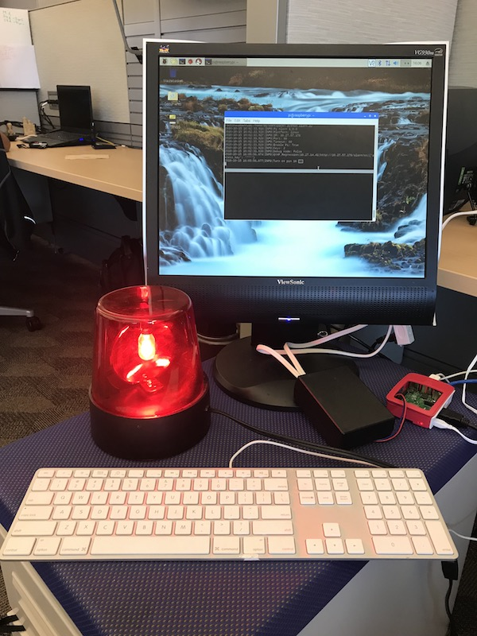
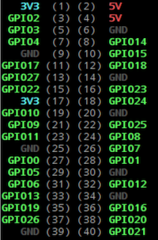

## Warning: Electricity 🔌⚡

Working with electricity can be dangerous. BUILD THIS PROJECT AT YOUR OWN RISK. Always follow proper safety precautions. Always work under the supervision of a qualified professional. T-MOBILE and other contributors are NOT RESPONSIBLE for the serious injuries and death that can occur.

### Staying Safe

Though this project *can* use with a standard power outlet to power the alarm, but that **does not** mean *you* should do it that way. For safety sake we recommend using a battery-powered LED light.

## Equipment and Parts You'll Need

| Item                                                 | Purpose                                                 |
| ---------------------------------------------------- | ------------------------------------------------------- |
| Raspberry Pi 3                                       | Hosts the web server to control the relay (switch)      |
| HDMI-compatible monitor, wireless keyboard and mouse | Interact with the Pi                                    |
| Ethernet cable                                       | Network/internet connectivity                           |
| 5VDC Relay switch                                    | Control the power to the light                          |
| Alarm Light                                          | Indicate when attention is needed (e.g. a broken build) |
| Extension cord                                       | Provide a controllable power outlet                     |
| Jumper wires                                         | Communication between the Pi and the relay              |
| Housing for relay                                    | Wiring safety and organization                          |
| USB Battery pack (optional)                          | Power the Pi                                            |

### About the Relay Switch

The alarm is powered by a 120V outlet. The relay switch opens and closes the 120V power supply.  The relay switch has 3 input controls (`+`, `-`, and `S`).  The `+` and `-` provide the power to the relay.  The `S` turns the relay on and off.  The `+` pin on the relay connects to Pi pin `4` (5V).  The `-` pin on the relay connects to Pi pin `6` (ground).  The `S` pin on the relay connects to Pi pin `12` (GPIO 18).

